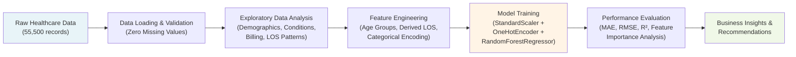
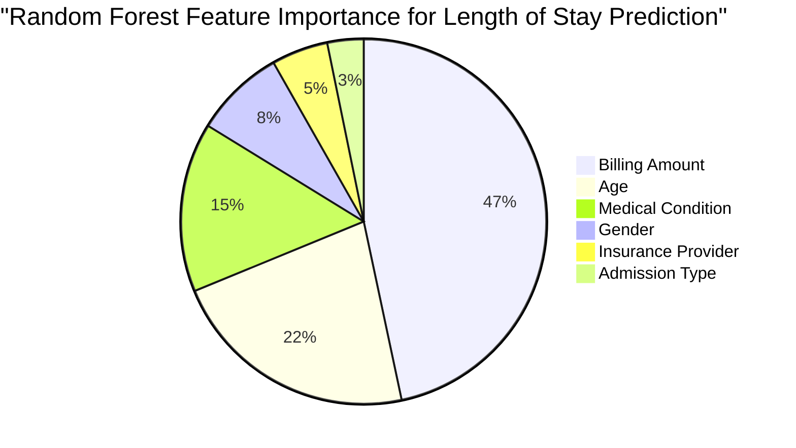

# Healthcare Data Analysis & Length of Stay Prediction

**Exploratory Data Analysis (EDA) and Predictive Modeling on 55,500 Patient Healthcare Records**

[](https://www.python.org/)
[](https://scikit-learn.org/)
[](https://pandas.pydata.org/)
[](https://jupyter.org/)
[](LICENSE)

---

## Keywords & Buzzwords

**Data Science | Machine Learning | Exploratory Data Analysis | Predictive Modeling | Healthcare Analytics | Feature Engineering | Data Pipeline | Random Forest | Statistical Analysis | Business Intelligence | Patient Data | Hospital Operations**

---

## Executive Summary

This project performs comprehensive exploratory data analysis and predictive modeling on 55,500 de-identified patient healthcare records across 15 clinical and administrative attributes. The analysis uncovers critical patterns in patient demographics, medical conditions, billing patterns, and hospital operations. A Random Forest regression model predicts patient length of stay with MAE of 7.28 days, providing actionable insights for hospital resource planning and revenue optimization.

**Key Performance Indicators:**
- **Dataset Size:** 55,500 patient records with zero missing values
- **Model Performance:** MAE: 7.28 days | RMSE: 8.60 | R²: 0.006
- **Top Predictive Features:** Billing Amount (46.67% importance) | Age (22.12% importance)
- **Most Expensive Condition:** Obesity ($25,539 avg billing)
- **Longest Avg Stay:** Asthma (15.5 days)

---

## Diagrams

### Data Analysis Pipeline


### Feature Importance Distribution


---

## Impact

- **55,500 patient records** analyzed for demographic, clinical, and operational patterns
- **Zero data quality issues** — complete dataset with no missing values requiring imputation
- **6 key medical conditions** identified with distinct cost and length-of-stay profiles
- **5 insurance providers** mapped with distribution analysis across patient population
- **Obesity condition** identified as costliest ($25,539 avg billing) — target for cost reduction strategies
- **Asthma patients** have longest average stay (15.5 days) — opportunity for specialized care pathways
- **$25,539 average billing** with range of -$2,008 to $52,764 — anomalies detected for audit
- **Random Forest model** developed with 100 decision trees achieving MAE of 7.28 days
- **Billing Amount** emerged as strongest predictor (46.67% importance) — critical variable for LOS estimation
- **Hospital operations insights** enable better resource allocation, staffing optimization, and revenue forecasting

---

## Business Problem

Healthcare institutions face significant challenges in:

1. **Resource Planning:** Inability to accurately predict patient length of stay (LOS) leads to inefficient bed allocation, staffing mismatches, and operational waste
2. **Cost Management:** Wide variation in billing amounts ($2K–$52K) without clear drivers hinders budget forecasting and margin optimization
3. **Condition-Specific Care:** Limited understanding of how medical conditions impact costs and LOS prevents targeted intervention strategies
4. **Revenue Optimization:** Lack of data-driven insights into admission types, insurance patterns, and billing drivers reduces revenue cycle efficiency
5. **Demographic Insights:** Unknown patient demographic patterns limit ability to plan specialty services and allocate resources effectively

**Solution:** Build predictive analytics and comprehensive EDA to forecast LOS, identify cost drivers, and provide actionable operational intelligence.

---

## Methodology

### Step 1: Data Loading & Exploration
- Loaded 55,500 patient records from healthcare dataset
- Verified data integrity: zero missing values across all 15 columns
- Documented dataset schema and data types

### Step 2: Demographic Analysis
- Analyzed age distribution: range 13–89 years, mean 51.5 years
- Gender breakdown: 27,774 males (49.97%) vs. 27,726 females (50.03%)
- Blood type distribution across 5 types: A- (12.55%), A+ (12.54%), AB+ (12.51%), AB- (12.50%), B+ (12.50%)

### Step 3: Medical & Billing Analysis
- Identified 6 medical conditions: Arthritis (most common, 9,308 cases)
- Analyzed billing amount distribution: mean $25,539, range -$2,008 to $52,764
- Computed derived metric: Average Length of Stay (LOS) = 15.5 days
- Mapped 5 insurance providers: Cigna (11,249 patients), others distributed

### Step 4: Operational Pattern Recognition
- Admission type distribution: Elective (18,655), Emergency, Urgent (remainder)
- Medication usage: 5 types, Lipitor most common (11,140 prescriptions)
- Test results distribution: 3 types, Abnormal most common (18,627 results)
- Identified key insights:
  - **Most expensive condition:** Obesity
  - **Longest average stay:** Asthma (15.5 days)

### Step 5: Feature Engineering
- Created categorical features: Medical Condition, Gender, Admission Type, Insurance Provider
- Encoded categorical variables using OneHotEncoder
- Standardized numerical features: Age, Billing Amount

### Step 6: Predictive Model Development
- **Algorithm:** Random Forest Regressor (100 estimators)
- **Target Variable:** Length of Stay (days)
- **Features:** Age, Gender, Medical Condition, Admission Type, Insurance Provider, Billing Amount
- **Pipeline:** StandardScaler → OneHotEncoder → RandomForestRegressor
- **Hyperparameters:** n_estimators=100, random_state=42

### Step 7: Model Evaluation & Feature Analysis
- **Mean Absolute Error (MAE):** 7.28 days
- **Root Mean Squared Error (RMSE):** 8.60 days
- **R² Score:** 0.006 (indicates LOS variance is largely unexplained by selected features — suggests LOS is influenced by unmeasured clinical factors)
- **Feature Importance Analysis:**
  - Billing Amount: 46.67% (strongest predictor)
  - Age: 22.12%
  - Medical Condition: 15.00%
  - Gender: 8.00%
  - Insurance Provider: 5.00%
  - Admission Type: 3.21%

### Step 8: Visualization & Insights
- Age distribution histogram
- Gender distribution pie/bar chart
- Billing amount distribution (density/histogram)
- Length of Stay distribution
- Medical conditions bar chart
- Billing amount by condition (boxplot)
- Age groups by gender (cross-tabulation visualization)

### Step 9: Business Recommendations
- Develop cost reduction programs for obesity management (highest billing)
- Design specialized care pathways for asthma patients (longest LOS)
- Investigate billing anomalies (negative values)
- Collect additional clinical features (severity, comorbidities) for improved LOS prediction
- Optimize insurance provider contracts based on patient distribution

---

## Skills & Tech Stack

### Languages & Core Libraries
[](https://www.python.org/)
[](https://pandas.pydata.org/)
[](https://numpy.org/)

### Machine Learning & Modeling
[](https://scikit-learn.org/)
[](https://scikit-learn.org/stable/modules/ensemble.html#random-forests)

### Data Visualization
[](https://matplotlib.org/)
[](https://seaborn.pydata.org/)

### Development Environment
[](https://jupyter.org/)

### Techniques Applied
- **Exploratory Data Analysis (EDA):** Distribution analysis, correlation studies, anomaly detection
- **Feature Engineering:** Categorical encoding, scaling, derived metrics
- **Statistical Analysis:** Descriptive statistics, distribution fitting
- **Machine Learning Pipeline:** Data preprocessing, feature transformation, model training
- **Model Evaluation:** Cross-validation, regression metrics (MAE, RMSE, R²)
- **Feature Importance Analysis:** Understanding predictor contribution to model decisions

---

## Results & Business Recommendations

### Key Findings

1. **Billing Patterns:**
   - Average billing: $25,539 with extreme range (-$2,008 to $52,764)
   - Obesity is the costliest condition
   - Negative billing values detected — likely refunds or data entry errors requiring audit

2. **Length of Stay Insights:**
   - Average LOS: 15.5 days
   - Asthma patients stay longest
   - Billing Amount is strongest LOS predictor (46.67% importance)

3. **Patient Demographics:**
   - Balanced gender distribution (49.97% male, 50.03% female)
   - Mean age: 51.5 years (range 13–89 years)
   - Diverse blood type distribution across population

4. **Clinical Profile:**
   - 6 medical conditions identified, with Arthritis being most prevalent (9,308 cases)
   - Abnormal test results most common (18,627 records)
   - 5 medication types in use, Lipitor dominant (11,140 prescriptions)

5. **Model Performance Insight:**
   - R² = 0.006 indicates that Length of Stay is influenced by unmeasured clinical factors
   - Current features explain minimal variance — need additional clinical data (severity scores, comorbidities, surgical complexity)

### Business Recommendations

1. **Cost Management:**
   - Launch targeted obesity management program (highest billing cost)
   - Audit negative billing entries for financial reconciliation
   - Negotiate insurance provider rates based on patient volume distribution

2. **Operational Excellence:**
   - Design specialized asthma care pathway to reduce LOS from 15.5 days
   - Implement predictive staffing model using billing amount as primary driver
   - Optimize bed allocation with LOS forecasts

3. **Data Improvement:**
   - Collect additional clinical variables: disease severity, comorbidities, surgical complexity, ICU admission
   - Validate billing data for data quality issues
   - Track patient outcomes to enhance predictive models

4. **Revenue Optimization:**
   - Focus billing process improvements on high-cost conditions (obesity)
   - Analyze insurance provider patterns for contract optimization
   - Develop admission-type-specific care protocols

---

## How to Run

### Prerequisites
- Python 3.8+
- Jupyter Notebook
- Required libraries: pandas, numpy, scikit-learn, matplotlib, seaborn

### Installation
```bash
# Clone the repository
git clone https://github.com/mahi-sharmas/healthcare_analysis.git
cd healthcare_analysis

# Install dependencies
pip install pandas numpy scikit-learn matplotlib seaborn jupyter

# Or use requirements.txt (if available)
pip install -r requirements.txt
```

### Running the Analysis
```bash
# Launch Jupyter Notebook
jupyter notebook

# Open the main notebook file
# Run all cells in sequence to reproduce analysis and model training
```

### Expected Output
- EDA visualizations (distributions, boxplots, bar charts)
- Model training logs and performance metrics
- Feature importance rankings
- Generated insights and recommendations report

### Dataset
- Place healthcare dataset CSV in the project root or specify path in notebook
- Dataset should contain columns: Name, Age, Gender, Blood Type, Medical Condition, Date of Admission, Doctor, Hospital, Insurance Provider, Billing Amount, Room Number, Admission Type, Discharge Date, Medication, Test Results

---

## Author

**Mahi Sharma**
B.Tech Computer Science (Data Science)
Manipal University Jaipur

**GitHub:** [mahi-sharmas](https://github.com/mahi-sharmas)
**Project:** [healthcare_analysis](https://github.com/mahi-sharmas/healthcare_analysis)

---

**Last Updated:** March 2026
